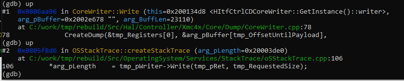
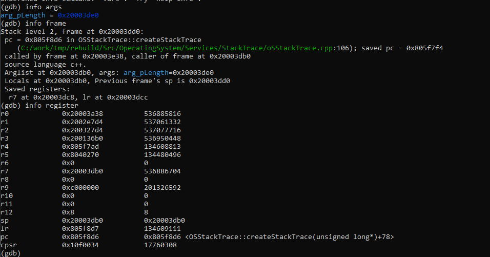
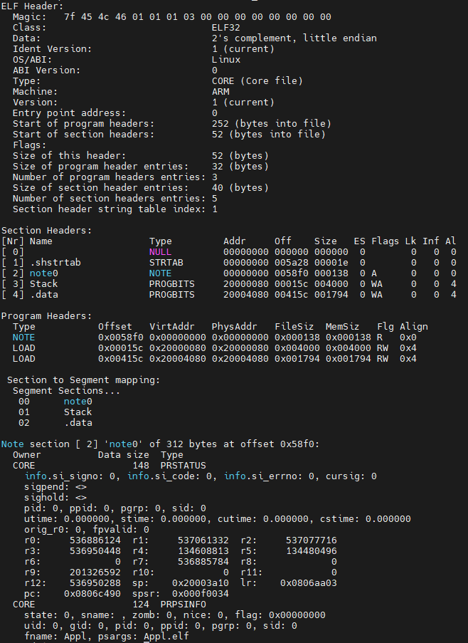

# ELF Core Writer for ARM-Cortex M processors

This library can be used to create an ELF core dump file into a provided buffer. When the file is written to the file system it can be later analyzed using `arm-gdb`.
With that, stack traces can be generated for post-mortem analyses.

## How To Use
1) Create a memory info instance: `MemoryInformation memInfo{stackEnd, stackSize, dataEnd, dataSize}`. The object needs the end addresses of the stack and data segment as well as their size. This information can usually be obtained using the linker script (`*.ld`)
2) Create an instance of the core writer and pass the memory Info: `CoreWriter writer{memInfo}`
3) Allocate a memory buffer, e.g. using `new`. The size of the buffer should match the size of the stack and data segment as well as additional bytes for the elf headers
4) Call `auto written = writer.Write(buffer, buffLen)`. The elf-file is now stored in the buffer
5) If written > 0, the provided buffer was sufficient for the stack trace
6) Now write the stack trace to the file system

## Analyze the core-dump file
* Start the `arm-none-eabi-gdb` console
* Load your executable elf: `file exec.elf`
* Now load the core-dump elf: `core-file core-dump.elf`
* *Important: If another core-file should be loaded, restart GDB!*

### Useful commands
* `bt` - create the stack trace
* `up / down` - navigate through the stack trace
* `info register` - shows the register values of the active frame
* `info args` - shows the function arguments of the active frame
* `info frame` - shows important values of the active frame

### Example
See the following images to have an impression on how the final result will look like.
The first frames of a using `bt`:


One can see that the last frame is always the `CreateDump()` function. However, the higher levels contain the program flow and with that the stack trace of the system.

With `up` one can switch between active frames:



Then, local variables and registers can be analyzed too using the `info ...` commands:



### Limitations

While variables stored in the `.data` sections ara analyzable, too (because they were save as section), uninitialized `.bss` data is not.
The main reason here was to reduce the size of the core file in an embedded setting where there is just one process running. 
`gdb` will show a warning with unknown addresses, here. 

### Troubleshooting / Analyze core-file
Use the `eu-readelf` to analyze the core dump file in case of problems. The command `eu-readelf -a coredump.elf` should produce an output like this:



If not, the file might be corrupted.

## Add a section header
Sometimes, custom or additional section should be added. Perform the following steps to do so: 

1) increase `CoreWriter::st_cCountSectionHeaders` by 1
2) add the name of section to `CoreWriter::st_cStringTable`
3) add the index to name of the new section in string table (similar to the existing variables)
4) add the index to store the position of the section header in the elf file  (similar to the existing variables)
5) add the section to `CoreWriter::createSectionHeaders` similar to the existing sections
6) if required, add the payload of the section as byte array (see e.g. `CoreWriter::createNoteSectionsPayload`)
7) link header index and payload using `Elf::AddGenericPayload`
8) add the payload size in `CoreWriter::GetMaxRequiredNumberOfBytes`
9) make sure to extend the allowed number of sections and payloads in the `Elf` class

Similar steps are to be done when adding a program header.

## Receive stack / data addresses
Typically, these sections are defined in a linker file.  E.g., STM32 Nucleo defines the following data section
```
_  .data :
{
. = ALIGN(4);
_sdata = .;        /* create a global symbol at data start */
*(.data)           /* .data sections */
*(.data*)          /* .data* sections */

    . = ALIGN(4);
    _edata = .;        /* define a global symbol at data end */

} >RAM 
```
Here, we can use the `_sdata` and `_edata` symbols to create the memory information. if they are defined for the stack as well, one can use the following code to load them in the code:
```
extern char DataStart asm("_sdata");
extern char DataEnd asm("_edata");
extern char StackEnd asm("_estack");
extern char StackStart asm("_sstack");

MemoryInformation memInfo{(uint32_t)&StackStart, (uint32_t)&StackEnd, (uint32_t) &DataStart, (uint32_t) &DataEnd};
```

If the symbols do no exist, add them in the linker file or read the addresses form the sections in the `elf` file using `eu-readelf`. 

## Adapt Crash dummy
Currently, a dead end in `crash_dummy.cpp` from the header `crash.h` is implemented to make the code more lean. Provide an own implementation to remove the exception.